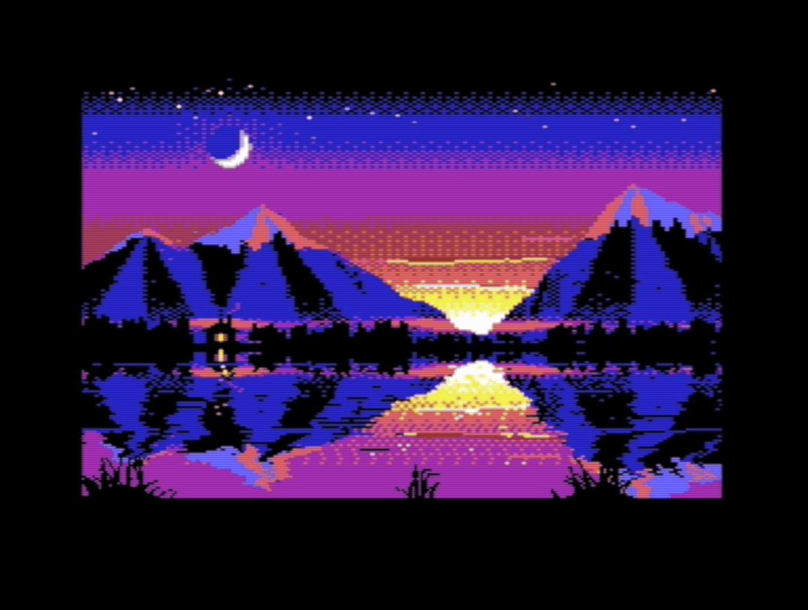
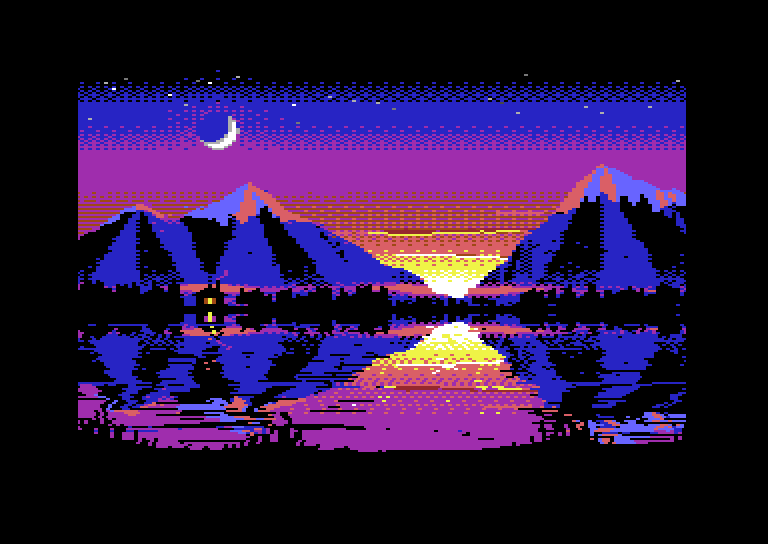

# C64 graphics harness



An agent-friendly loop for Commodore 64 graphics:

1. Build a **scene image**: one `.prg` holding the 16K VIC bank, the VIC-II shadow registers, color RAM, and a raster routine of up to 4K.
2. Inject it into a **headless VICE** (x64sc, cycle exact) in one memory write.
3. Wait for the routine to **signal READY**.
4. Capture **N exact, complete frames** as PNGs, plus a JSON report an agent can reason about.

```sh
make setup                              # once: builds headless VICE 3.10 into tools/, fetches KickAssembler
make capture SCENE=testcard FRAMES=8    # assemble + run + capture -> out/testcard/
make test                               # end-to-end tests (32 tests, ~3 s)
```

A capture takes about 0.1 s: launch, power-on boot, injection, READY, and 8 frames.

Requirements: a C toolchain, Java 17+, and Python 3 with Pillow and numpy. Tested on macOS 26 (arm64).

## Showcase: Afterglow

`scenes/afterglow` is a mountain lake at twilight, made entirely in this loop. The animation at the top is the harness's CRT view of its seamless 64-frame loop. Below are the exact frames VICE captured (2×). `build/afterglow/run.prg` autostarts in a PAL emulator.



- **Per-line background.** A stable raster IRQ (CIA timer, line 49) starts a cycle-exact kernel down the display. On every line it writes `$D021` and `$D016` in the right border, badlines included. The sky's gradient bands are background color, so each cell's three colors stay free for the moon, snow, clouds and rock.
- **PAL mixing.** The rose band under the purple is purple and orange on alternating lines. The two share a luma level, so a PAL delay line blends them into a color the palette doesn't have. Compare `frames/` with `crt/`.
- **A moving lake.** The water is a mirror on a black background. Each frame the kernel gets new xscroll values per lake line (two waves rolling toward the viewer, so the reflection wobbles) and ripple lines that light up the black. Black that must stay dark, like the shore and parts of the reflection, comes from a cell color instead, so the ripples break into glints.
- **Reeds in front.** The reeds on the near shore are hires sprites 3–7. Sprites ignore xscroll, so the reflection slides behind them while they stand still. Their data fetches stall the CPU from cycle 60 to cycle 9 on every line they cover, so the kernel unrolls those lines: the stores move to cycles 55 and 59, and each fetch restarts the line on cycle 10. On the two badlines under the reeds, where the CPU gets 7 cycles, the line before preloads a register. The bank beneath them is a straight black edge, which looks the same when the wobble shifts it.
- **Stars** twinkle from color RAM. The animation is 64 records (6.4K) in the VIC bank's free space, copied in during the lower border in about 3,200 cycles.
- **Painting** is procedural numpy in `gfx.py`: a banded sky, rock faceted by ridge spurs and lit from the glow, alpenglow snow, mist, pines, the reflection and the reeds. An encoder in the scene fits each 4×8 cell to its lines' backgrounds plus three colors, and chooses each line's background to minimize clash. 98 of 32,000 pixels fall back to the nearest luma.

```sh
make capture SCENE=afterglow FRAMES=64 CRT=1        # 64 unique frames, loops every 64
make probe SCENE=afterglow AT="row section animated" # rows on cycle 10, sprite section from line 218, done by line 292
```

## Layout

| Path | What |
|---|---|
| `include/harness.asm` | Image layout (segments, `.file`s) and runtime macros for KickAssembler |
| `include/stable.asm` | Cycle-exact raster IRQs: double IRQ, CIA timer, and `HX_Delay` (imported by `harness.asm`) |
| `harness/` | Python package. `python3 -m harness capture\|crt\|inspect\|probe`, plus `harness.gfx` encoders for generators |
| `scenes/<name>/` | A scene: `main.asm` (code + VIC setup) and an optional `gfx.py` (writes the bank and color RAM) |
| `scenes/_template/` | Starting point for `make new SCENE=<name>` |
| `scenes/testcard/` | Exercises every path; the tests check its pixels |
| `scenes/afterglow/` | The showcase: a per-line `$D021`/`$D016` kernel (sprite-aware), PAL mixing, a 64-frame lake animation |
| `docs/` | README images: `make showcase` recaptures afterglow and rebuilds them (needs ffmpeg) |
| `tools/setup.sh` | Builds VICE and fetches KickAssembler into `tools/` (nothing is installed system-wide) |
| `build/<scene>/` | `image.prg`, `run.prg`, `main.vs` (VICE labels), generated data |
| `out/<scene>/` | Capture results |

## Image format: C64H v1

A standard `.prg` with load address `$3B00`. Everything is contiguous, so one memory write loads the whole thing.

| Range | Size | Content |
|---|---|---|
| `$3B00-$3BFF` | 256 | Header page |
| `$3C00-$3FE7` | 1000 | Color RAM shadow (low nybble). `HX_Init` copies it to `$D800`. |
| `$4000-$7FFF` | 16384 | VIC bank 1. Every byte is visible to the VIC-II. |
| `$8000-$8FFF` | ≤ 4096 | Raster routine. The file ends at its last byte; overflow is an assembly error. |

**Why this order:**
- Bank 1 is the only bank where the VIC-II sees all 16K as RAM. Banks 0 and 2 have the character ROM shadow, and bank 3 overlaps I/O, the KERNAL and the CPU vectors.
- Everything the VIC-II uses sits in one run in front of the code: registers, then color RAM, then the bank. Color RAM lives outside any bank, so the image has to carry it.
- The code comes last because it is the only variable-length part, so nothing needs padding.
- The header comes first, so the magic bytes are at file offset 2.

**Header page:**

| Offset | Field |
|---|---|
| `+$00` | `"C64H"` |
| `+$04` | Version (1) |
| `+$05` | Flags (bit 0: NTSC) |
| `+$06` | Entry address (word, normally `$8000`) |
| `+$08` | **`HX_STATUS`** mailbox: 0 booting, 1 READY, `$80+n` error *n* |
| `+$09` | **`HX_FRAME`** (optional frame counter) |
| `+$40-$6E` | **VIC-II shadow**, `$D000-$D02E` one-to-one |
| `+$80-$BF` | Title (ASCII, NUL-terminated) |

**Routine contract:**
- Execution starts at the entry address with interrupts masked.
- When initialized, write 1 to `HX_STATUS` (`HX_SignalReady()`).
- Optionally `inc HX_FRAME` once per frame (`HX_FrameTick()`).
- A fatal problem can be reported with `HX_SignalError(n)`.

`HX_Init()` puts the machine into the documented state:
- KERNAL and BASIC banked out (`$01=$35`).
- CIA interrupts off.
- NMI and IRQ vectors pointing at an RTI.
- VIC bank 1 selected.
- Color RAM and the VIC-II registers copied from the image. `$D019` and `$D01A` are not copied; `HX_StartIrq` enables raster IRQs.

**Memory free at runtime:** `$0002-$3AFF` and `$9000-$FFF9`. `$D000-$DFFF` is I/O.

`run.prg` is the same image plus a BASIC `SYS` stub at `$0801`. Drop it on any emulator, or send it to real hardware, and it autostarts. Writes to the mailbox are harmless there.

## Capture protocol

The harness talks to VICE over its binary monitor. While the emulation runs, VICE only polls that socket once per frame, at vsync. On PAL that is right after raster line 311, so every stop happens at line 0 with a complete frame in the draw buffer.

1. **Boot.** Launch `x64sc -default -warp -model c64|ntsc -VICIIborders <mode> -jamaction 0 ...` on a free localhost port. Power-cycle it and stop in the KERNAL's READY key-wait loop (`$E5CD`). Emulated time is deterministic from here on.
2. **Inject.** Write the image into RAM at `$3B00`. Set PC to the entry address with I set.
3. **READY.** Run one frame at a time by sending `Exit` and a memory read *in one socket write*. VICE resumes, finds the read still queued at the next vsync, and stops there. Each frame, check `HX_STATUS`.
4. **Capture.** Same loop with `Display Get` added. Every step is exactly one emulated frame. Frame 0 is the first frame that started after READY. The tests prove there are no dropped or duplicated frames and that runs are deterministic.

`python3 -m harness capture IMAGE` options:

| Option | Effect |
|---|---|
| `-n/--frames N` | Frames to capture (default 4) |
| `--skip S` | Let S frames pass after READY first |
| `--every K` | Capture every Kth frame |
| `--borders normal\|full\|none` | Visible area: 384×272, 408×293 or 320×200 on PAL. `debug` works on NTSC only (VICE 3.10 bug). |
| `--crop window` | Only the 320×200 display window |
| `--pal` / `--ntsc` | Override the header flag |
| `--palette colodore` | Any VICE `.vpl` name or a path |
| `--zoom N` | Scale of the `zoom/` copies |
| `--ready-timeout F` | Emulated frames to wait for READY (default 500) |
| `--json` | Print the full report instead of the summary |

Outputs in `out/<scene>/`:
- `frames/NNN.png`: 1×, indexed, pixel-exact.
- `zoom/NNN.png`: 2× nearest neighbour.
- `contact_K.png`: 4×2 sheets.
- `anim.gif`
- `crt/NNN.png`: only with `--crt` (`make capture CRT=1`). The frames as a PAL/NTSC monitor shows them; see CRT view below.
- `vice.log`
- `report.json`:
  - the image decode (mode, addresses, sprites, colors);
  - geometry (for PAL normal, the display window is at (32,35) and raster line = 16 + y);
  - frames until READY;
  - per frame: sha1, `HX_FRAME`, stop position, a color histogram by name, changed pixels and their bounding box versus the previous frame;
  - unique-frame count and loop period;
  - warnings.

Exit codes:

| Code | Meaning | What you also get |
|---|---|---|
| 0 | OK | — |
| 2 | No READY before the timeout | The PC with its KickAss label, plus `diagnostic.png` |
| 3 | CPU JAM | The PC and label |
| 4 | The routine signalled an error | — |
| 1 | Anything else | — |

## Writing a scene

`make new SCENE=sunset` copies `scenes/_template`. A scene has two parts:

- **`gfx.py`**: paints at C64 resolution with numpy, encodes with `harness.gfx`, places data in a `Bank`, and calls `write()`. That produces `bank.bin`, `colorram.bin`, and `gfx.asm` (`.const` symbols) in the build dir.
  - Encoders: `encode_mc_bitmap` and `encode_hires_bitmap`, which report color clash.
  - Packers: `pack_mc_bitmap` and `pack_hires_bitmap`.
  - Sprites: `sprite_hires` and `sprite_mc`.
  - Helpers: `d018`, `sprite_pointer`, `quantize`, `LUMA_ORDER`.
- **`main.asm`**: sets up the image with `HX_Header(entry, title, flags)` and `HX_VicShadow(Hashtable().put($d011, $3b, ...))`, then `.import binary` the generated data. The code calls `HX_Init()`, `HX_StartIrq(handler, line)` and `HX_SignalReady()`. IRQ handlers chain with `HX_NextIrq`, using `HX_IrqEnter`/`HX_IrqExit`.

`make inspect SCENE=x` decodes an image without running it.

## CRT view

The captured frames are pixel-exact. On a real screen, dithers merge and lines mix. `--crt` adds `crt/NNN.png`, which shows the frames the way a Commodore 1084S-style monitor fed the C64's separate luma and chroma signals shows them. Without recapturing, `make crt SCENE=x` (or `python3 -m harness crt out/<scene>`) renders the last capture.

The model (`harness/crt.py`):

1. **Blend in the video signal, not in sRGB.** Colodore's palette is the signal shown on a gamma-2.8 PAL CRT and re-encoded for a 2.2 display. So palette colors are converted back to the signal and turned into Y'UV. There, five of the seven same-luma color pairs match to within 2% (closer than in sRGB). Blue/brown and yellow/light green differ by 5–7%.
2. **Horizontal bandwidth:** luma σ = 0.25 px, chroma σ = 1.1 px (about 1 MHz). That chroma width matches VICE's 4-pixel chroma average, and it's why a checkerboard of two equal-luma colors turns into a solid third color.
3. **PAL delay line:** each line's chroma is averaged with the line above. That's how alternating lines of an equal-luma pair become a solid mixed color ("PAL mixing"). NTSC has no delay line, so its alternating lines stay striped.
4. **CRT gamma and beam:** convert to linear light. Each raster line is drawn as a Gaussian beam that widens as it gets brighter, which gives scanlines on dark areas and bloom on bright ones.
5. **Aspect and output:** pixel aspect 0.936 on PAL and 0.75 on NTSC. Output is 3 rows per raster line (1078×816 for a PAL frame).

Large flat areas keep their exact palette color, averaged over a line's rows; the tests check this for all 16 colors. Luma differences are not blended away: a dither between colors of different brightness stays visible as texture, just as on a real monitor.

Options on the `crt` command: `--scale`, `--no-scanlines`, `--no-delay-line`, `--luma-blur`, `--chroma-blur`, `--pal/--ntsc`, `--palette`.

Not modeled: composite/RF cross-color and dot crawl, and the VIC-II's odd-line phase error.

## Stable rasters

A raster IRQ normally starts 0–7 cycles late, depending on which instruction it interrupted, so mid-line color changes wobble from frame to frame. `include/stable.asm` provides two cures. Each one replaces `HX_IrqEnter` at the top of a handler, and the handler still ends with `HX_NextIrq` + `HX_IrqExit`.

| | `HX_StableDoubleIrq()` | `HX_StableTimerInit()` once + `HX_StableTimerIrq()` |
|---|---|---|
| How | A second raster IRQ lands in a NOP slide, then a `$D012` compare absorbs the last cycle | CIA1 timer A runs locked to the raster; each IRQ reads how late it is and burns the difference |
| Lands on | Line **L+2**, cycle **3** | Line **L**, cycle **47** |
| Cost | Rest of line L plus all of line L+1 | 31–38 cycles of handler time |
| Needs | No badline or sprite DMA on L..L+2; L ≠ 255 | No badline or sprite DMA on L; L ≠ 0; owns CIA1 timer A |

- Cycles are 0-based, as in VICE's monitor, and are the same on PAL and NTSC.
- A color register write whose last cycle is cycle *c* shows from frame column **8c − 95** (normal borders).
- `HX_Delay(n)` waits exactly *n* cycles.

`tests/test_stable.py` checks both techniques on PAL and NTSC, under a main loop that makes every IRQ arrive with a different lateness. A placement where a timing branch would cross a page is an assembly error.

To see where any code runs, use `make probe SCENE=x AT="label ..."` (or `python3 -m harness probe IMAGE --at LABEL`). It stops VICE at each label for N frames and reports the raster line and cycle, so a stable handler shows a single position:

```
         irq_a $8140   40 hits  line $050 cycles 9-15  (jitter: 7 different positions)
      a_stable $8175   40 hits  line $052 cycle 3  (stable)
```

## VICE build notes

`tools/setup.sh` builds **VICE 3.10** with `--enable-headlessui` and applies three one-line upstream fixes:
- **r46032:** a macOS include fix.
- **r46240:** fixes a segfault when stdout is piped.
- **r46020:** fixes Display Get, which in 3.10 drops the last 4 pixels and writes 4 bytes past the end of its buffer.

`makeinfo`, `dos2unix` and `xa` are only presence-checked by configure, so they are stubbed with `true`.

Override the emulator with `C64H_X64SC=/path/to/x64sc` or `--x64sc`. Only the headless build from `tools/setup.sh` is tested. A GUI build would open a window, and the Display Get fix above would be missing.
